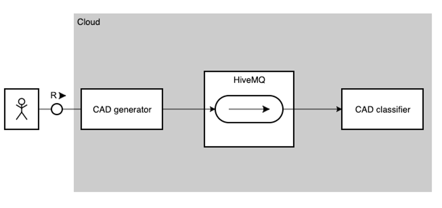
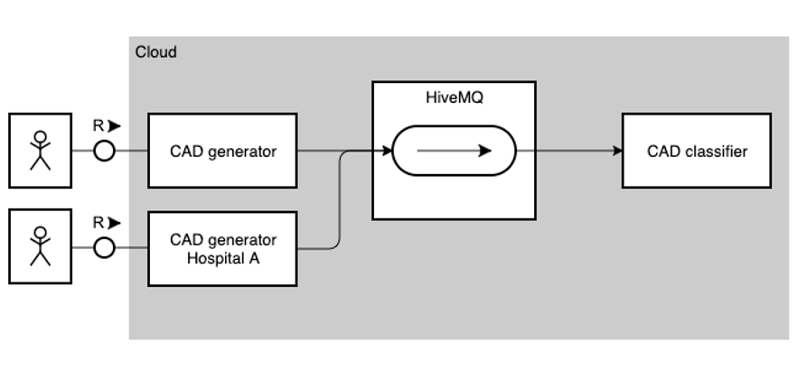

# CAD Classifier

This project intends to test the integration between HiveMQ, Python scalable applications, Keras models and cloud foundry.
This project uses:
- SAP Hana trial (cloud foundry)
- HiveMQ (MQTT broker)
- Base64 encode and decode 

## Architecture

## Organization

The project contains these two main folders:

### cad-predictor

This is a python application containing a keras trained model listening from a MQTT queue.

### cad-generator

This is a python application containing some images to be sent for cad-predictor

## Extensibility

To extend the project and make it useful, we can add a new cad-generator, simulating different source of information.

